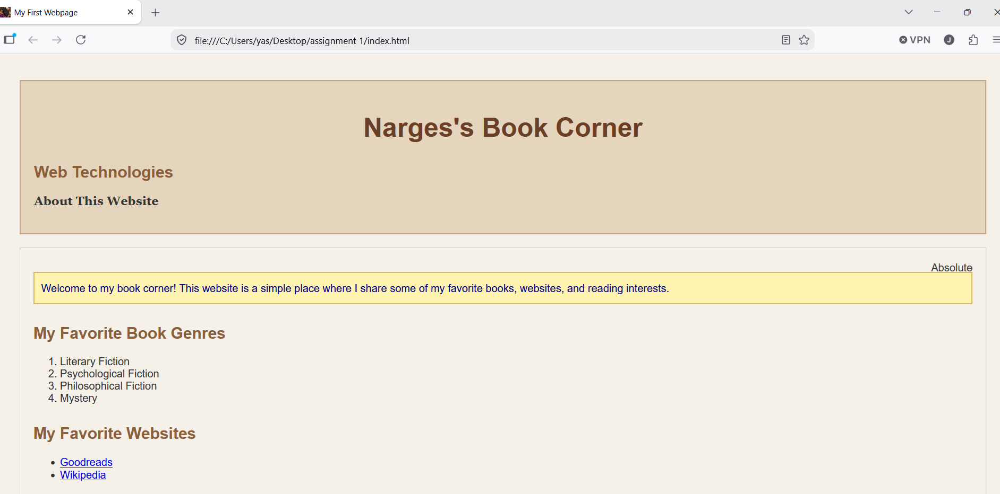
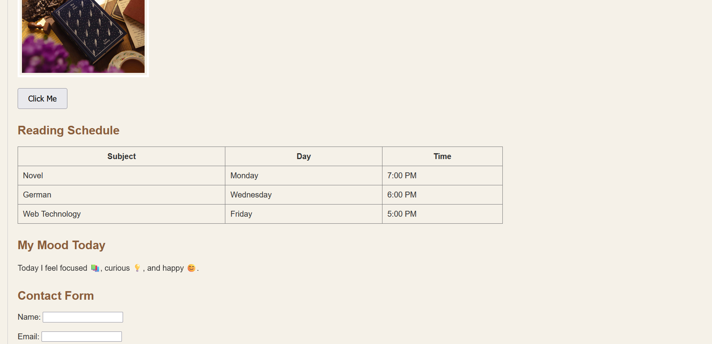
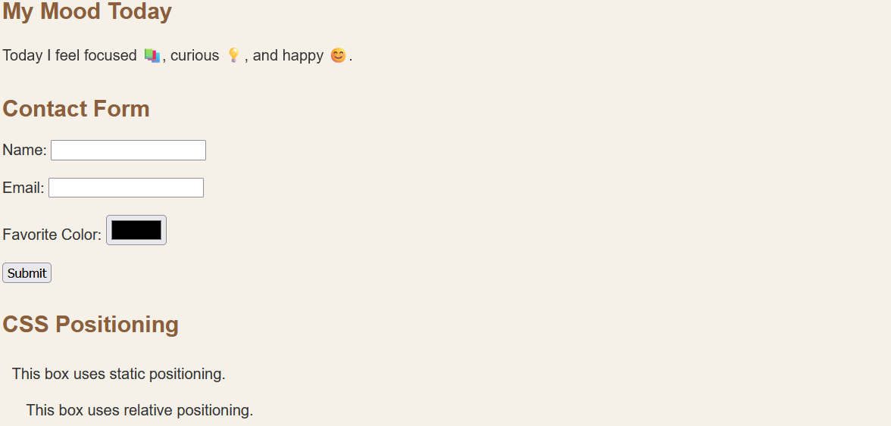
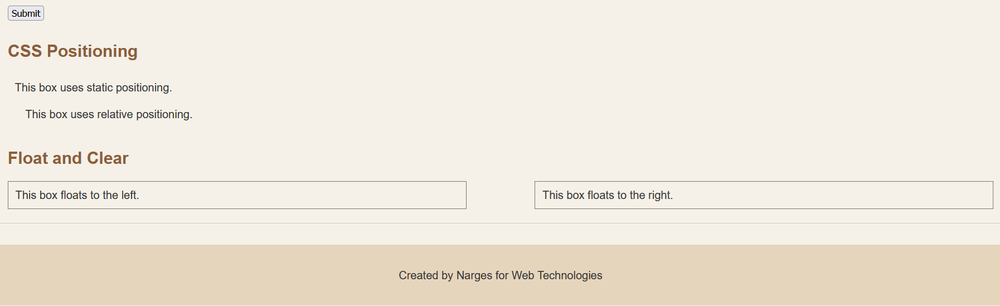

# Assignment 1 - HTML & CSS Basics

**Name:** Narges  
**Course:** Web Technologies

## Objective

The objective of this assignment was to practice the basic concepts of HTML and CSS and create a simple webpage.

## Features

The webpage includes:

- Headings and paragraphs
- Ordered and unordered lists
- Links
- An image and favicon
- A button
- A table
- A contact form
- CSS styling
- Static, relative, and absolute positioning
- Float and clear

## Screenshots

### Part 1 - HTML Basics

### Part 2 - Intermediate HTML

### Part 3 - CSS Styling

### Part 4 - Intermediate CSS

## Summary

I created a webpage called "Narges's Book Corner" using HTML and CSS. I first built the structure with HTML and then used CSS to control the appearance, spacing, positioning, and layout of the webpage.
